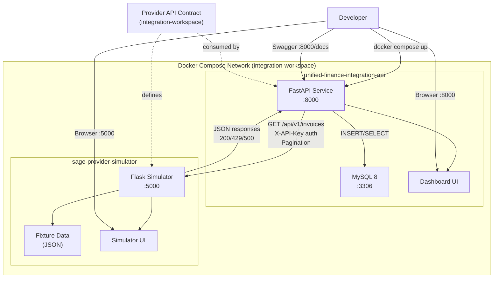
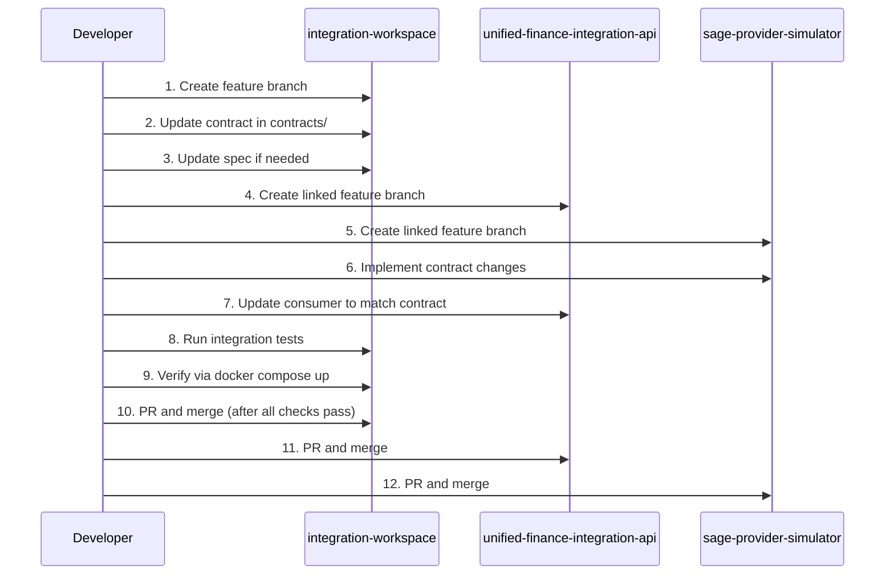

# Implementation Plan — Unified Finance Integration v0.1.0

**Version:** 0.1.0
**Status:** Draft
**Date:** 2026-09-08
**Specification:** [spec.md](spec.md)
**Constitution:** [constitution.md](../../.specify/memory/constitution.md)

---

## 1. Repository Boundaries and Responsibilities

### 1.1 `integration-workspace` (this repository)

| Aspect | Details |
|---|---|
| **Owns** | Cross-service architecture, provider API contract, Docker Compose orchestration, environment configuration, local-development docs, release-process docs, integration validation |
| **Does not own** | FastAPI business logic, Flask business logic, service-specific unit tests |
| **Technology** | Docker Compose, Markdown, OpenAPI/JSON Schema, shell scripts |
| **Key files** | `compose.yaml`, `.env.example`, `contracts/`, `docs/`, `tests/integration/` |

### 1.2 `unified-finance-integration-api` (FastAPI)

| Aspect | Details |
|---|---|
| **Owns** | Public API endpoints, sync orchestration, invoice normalization, MySQL persistence, Swagger docs, web dashboard |
| **Does not own** | Provider simulation, API contract definition, Compose orchestration |
| **Technology** | Python, FastAPI, SQLAlchemy/MySQL, Jinja2 templates |
| **Key files** | `app/`, `tests/`, `Dockerfile`, `requirements.txt`, `alembic/` |

### 1.3 `sage-provider-simulator` (Flask)

| Aspect | Details |
|---|---|
| **Owns** | Deterministic provider simulation, fixture invoices, X-API-Key auth, pagination, predictable error scenarios, simulator UI |
| **Does not own** | Invoice normalization, data persistence, Compose orchestration |
| **Technology** | Python, Flask, static fixture data (JSON/YAML) |
| **Key files** | `app/`, `tests/`, `Dockerfile`, `fixtures/` |

> **Important:** The provider simulator is a **local portfolio simulator**.
> It must never be described as an official Sage API.

---

## 2. Architecture Diagram



---

## 3. API Contract Ownership and Change Workflow

### 3.1 Contract Location

The provider API contract lives in `integration-workspace/contracts/` as a
versioned file (e.g., `provider-api-v1.yaml` in OpenAPI 3.x format or
equivalent JSON schema).

### 3.2 Change Workflow



### 3.3 Contract Versioning

- Contract version follows `v<major>.<minor>` (e.g., `v1.0`).
- Breaking changes increment the major version.
- Additive changes increment the minor version.
- The contract file includes a version field and changelog.

---

## 4. Docker Compose and Environment Plan

### 4.1 `compose.yaml` (future — P0 implementation)

Services to define:

| Service | Image | Ports | Depends On | Health Check |
|---|---|---|---|---|
| `api` | Build from `../unified-finance-integration-api` | `8000:8000` | `db`, `simulator` | `GET /health` |
| `simulator` | Build from `../sage-provider-simulator` | `5000:5000` | — | `GET /health` |
| `db` | `mysql:8` | `3306:3306` | — | `mysqladmin ping` |

### 4.2 `.env.example` (future — P0 implementation)

```env
# === Database ===
MYSQL_ROOT_PASSWORD=changeme
MYSQL_DATABASE=unified_finance
MYSQL_USER=app
MYSQL_PASSWORD=changeme

# === Provider Simulator ===
PROVIDER_BASE_URL=http://simulator:5000
PROVIDER_API_KEY=test-api-key-not-a-secret

# === FastAPI ===
API_HOST=0.0.0.0
API_PORT=8000
DATABASE_URL=mysql+pymysql://app:changeme@db:3306/unified_finance

# === Flask Simulator ===
SIMULATOR_HOST=0.0.0.0
SIMULATOR_PORT=5000
```

> **Note:** The `.env.example` values are placeholders for local development.
> The `PROVIDER_API_KEY` is a non-secret test value (per A-007).

---

## 5. Integration Test Strategy

### 5.1 Test Layers

| Layer | Owner | Scope | Tooling |
|---|---|---|---|
| Unit tests | Service repos | Business logic, validation, transformations | pytest (FastAPI), pytest (Flask) |
| Contract tests | integration-workspace | Provider API compliance | pytest + OpenAPI validator, or schemathesis |
| Integration smoke tests | integration-workspace | End-to-end flow via Compose | pytest + requests, or shell scripts |

### 5.2 Contract Tests (P1)

- Validate that the simulator's responses match the provider contract.
- Validate that the FastAPI consumer correctly handles contract-compliant responses.
- Run against live Compose services.

### 5.3 Integration Smoke Tests (P1)

- Start full Compose stack.
- Trigger sync job.
- Verify invoices appear in the API response.
- Verify error scenarios (429, 500) are handled.
- Verify pagination traversal.

### 5.4 Test Prioritization

- P0: No integration tests in workspace (service repos implement their own unit tests first).
- P1: Contract tests and integration smoke tests in workspace.
- P2: Performance benchmarks and extended scenario tests.

---

## 6. Gitflow Workflow

### 6.1 Branch Strategy (per repository)

```mermaid
gitgraph
    commit id: "initial commit"
    branch develop
    commit id: "docs: spec and bootstrap"
    branch feature/compose-setup
    commit id: "feat: compose.yaml"
    commit id: "feat: .env.example"
    checkout develop
    merge feature/compose-setup
    branch feature/contract-v1
    commit id: "feat: provider contract v1"
    checkout develop
    merge feature/contract-v1
    branch release/v0.1.0
    commit id: "chore: release prep"
    checkout main
    merge release/v0.1.0 tag: "v0.1.0"
    checkout develop
    merge release/v0.1.0
```

### 6.2 Branch Naming

| Branch Type | Pattern | Example |
|---|---|---|
| Feature | `feature/<short-description>` | `feature/compose-setup` |
| Fix | `fix/<short-description>` | `fix/db-health-check` |
| Chore | `chore/<short-description>` | `chore/update-readme` |
| Release | `release/v<version>` | `release/v0.1.0` |
| Hotfix | `hotfix/<short-description>` | `hotfix/env-typo` |

### 6.3 Commit Convention

Format: `<type>(<scope>): <description>`

Examples:
- `docs(spec): add v0.1.0 specification`
- `feat(compose): add compose.yaml with all services`
- `chore(ci): add GitHub Actions workflow`

### 6.4 Cross-Repository Coordination

For changes spanning multiple repositories:

1. Start with the contract in `integration-workspace` and merge it to `develop` first.
2. Use linked feature branches with the same name in affected service repositories.
3. Implement and validate provider and consumer changes through their linked feature branches.
4. Verify the complete Compose flow passes with all linked branches checked out.
5. Create coordinated `release/*` branches only after the full Compose flow is validated.
6. The final merge-to-`main` ordering is a coordinated decision per release, not a rigid workspace-first sequence.
7. Tag releases consistently across all three repos.

---

## 7. Risks, Trade-Offs, and v0.1.0 Limitations

### 7.1 Risks

| ID | Risk | Impact | Probability | Mitigation |
|---|---|---|---|---|
| R-001 | Contract drift between workspace and service repos | Broken integration | Medium | Contract change workflow, P1 contract tests |
| R-002 | Docker networking differences across OS | Flaky local startup | Medium | Document platform-specific issues, test multi-OS |
| R-003 | Scope creep beyond P0 | Delayed delivery | High | Strict P0/P1/P2 gating, YAGNI enforcement |
| R-004 | MySQL startup latency | Flaky health checks | Low | Health check retries, `depends_on` with `condition: service_healthy` |

### 7.2 Trade-Offs

| Decision | Trade-Off |
|---|---|
| Static fixture data in simulator | Simpler but less flexible; acceptable for P0 local demo |
| Single Docker Compose file | Simpler but couples all services; acceptable for local dev |
| No database migrations tool in P0 | Auto-create schema on startup; migrations deferred to P1 |
| No CI in integration-workspace for P0 | Focus on service-level CI first; workspace CI added in P1 |

### 7.3 v0.1.0 Limitations

- No cloud deployment or production-readiness.
- No real provider API integration.
- No user authentication on dashboards.
- No automated contract validation (manual review in P0).
- No multi-database or multi-tenant support.
- Fixture data is static and limited.
- No monitoring, alerting, or observability beyond health checks.

---

## 8. Verification Gates Before Implementation

Before moving to implementation in any repository, the following gates must pass:

### Gate 1: Specification Approval

- [ ] `spec.md` reviewed and approved by the user.
- [ ] All user stories have acceptance criteria.
- [ ] Out-of-scope items are explicit and agreed upon.

### Gate 2: Plan Approval

- [ ] `plan.md` reviewed and approved by the user.
- [ ] Architecture diagram is accurate.
- [ ] Contract change workflow is understood.
- [ ] Repository boundaries are clear.

### Gate 3: Task List Approval

- [ ] `tasks.md` reviewed and approved by the user.
- [ ] P0 tasks have acceptance criteria.
- [ ] Dependencies are identified.
- [ ] No implementation tasks are in the workspace task list.

### Gate 4: Constitution Compliance

- [ ] All invariants (INV-001 through INV-015) are respected.
- [ ] No fabricated features, test results, or deployments.
- [ ] No secrets in any committed file.

### Gate 5: Branch Readiness

- [ ] Feature branch exists and is clean.
- [ ] `develop` is up-to-date.
- [ ] No uncommitted changes from previous work.

---

## 9. Implementation Order

After all gates pass, the recommended implementation order is:

1. **integration-workspace:** compose.yaml, .env.example, provider contract, README.
2. **sage-provider-simulator:** Flask app, fixtures, core invoice endpoint, API-key authentication, and a basic 500 error scenario. _(Pagination and the 429 scenario remain P1 only.)_
3. **unified-finance-integration-api:** FastAPI app, DB schema, sync job, normalization, dashboard.
4. **integration-workspace:** Integration smoke tests, contract tests.

> This order ensures the contract is defined before either service implements it,
> and the simulator is available for the API to consume during development.
