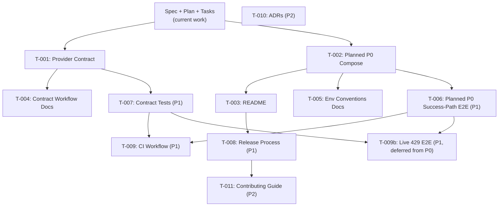

# Task List — Integration Workspace v0.1.0

**Version:** 0.1.0
**Status:** Draft
**Date:** 2026-09-08
**Specification:** [spec.md](spec.md)
**Plan:** [plan.md](plan.md)
**Constitution:** [constitution.md](../../.specify/memory/constitution.md)

> **Scope:** This task list contains ONLY tasks for the `integration-workspace`
> repository. It covers planning, documentation, contracts, orchestration,
> and validation. It does NOT prescribe application implementation tasks for
> `unified-finance-integration-api` or `sage-provider-simulator`.

---

## Task Status Legend

| Symbol | Status |
|---|---|
| ⬜ | Not started |
| 🔄 | In progress |
| ✅ | Complete |
| ❌ | Blocked |

---

## P0 — Core Orchestration and Contracts

### T-001: Create Provider API Contract v1

- **Status:** ⬜
- **Priority:** P0
- **Branch:** `feature/contract-v1`
- **Dependencies:** Specification and plan approved (this file).
- **Description:** Create the versioned provider API contract (OpenAPI 3.x)
  defining the simulator's `/api/v1/invoices` endpoint, including request/response
  schemas, authentication (X-API-Key header), pagination parameters, and error
  responses (401, 429, 500).
- **Deliverables:**
  - `contracts/provider-api-v1.yaml`
  - Invoice response schema
  - Pagination parameters schema
  - Error response schemas
- **Acceptance Criteria:**
  - [ ] Contract is valid OpenAPI 3.x.
  - [ ] Includes `/api/v1/invoices` GET endpoint.
  - [ ] Defines X-API-Key security scheme.
  - [ ] Defines pagination query parameters (`page`, `per_page`).
  - [ ] Defines 200, 401, 429, 500 response schemas.
  - [ ] Includes invoice object schema with required fields.
  - [ ] Contract version field is set to `v1.0`.
- **Traces to:** FR-003, CSI-001

---

### T-002: Plan and Document P0 Docker Compose Configuration

- **Status:** ⬜
- **Priority:** P0
- **Branch:** `feature/compose-setup`
- **Dependencies:** T-001 (contract defines service interactions).
- **Description:** Plan and document a P0 `compose.yaml` whose service set is
  exactly `api` and `simulator` (no database service, container, volume,
  health check, port mapping, or environment variable). The API reaches the
  simulator over Docker service DNS using
  `PROVIDER_BASE_URL=http://simulator:5000`. The accompanying `.env.example`
  defines only the variables required by `api` and `simulator`, with
  placeholder values and no `MYSQL_*` / `DATABASE_URL` variables.
- **Deliverables (planned — not yet implemented, executed, or verified):**
  - `compose.yaml` (planned) defining `api` and `simulator` only
  - `.env.example` (planned) with non-secret placeholder values
- **Acceptance Criteria:**
  - [ ] Planned `compose.yaml` defines exactly `api` and `simulator` services
        (no `db`, MySQL, or other database service).
  - [ ] `api` builds from `../unified-finance-integration-api`, port `8000`.
  - [ ] `simulator` builds from `../sage-provider-simulator`, port `5000`.
  - [ ] Both services expose `/health` and are on a shared Docker network.
  - [ ] `api` depends on a healthy `simulator` via `depends_on` with
        `condition: service_healthy`.
  - [ ] `api` is configured with
        `PROVIDER_BASE_URL=http://simulator:5000` for Docker service DNS.
  - [ ] `simulator` is configured with
        `PROVIDER_API_KEY=test-api-key-not-a-secret`.
  - [ ] `.env.example` contains only the variables required by `api` and
        `simulator`, with placeholder values.
  - [ ] No `MYSQL_*` variable, no `DATABASE_URL`, no database volume, no
        database port mapping, and no database health check exists in P0.
  - [ ] No real secrets are present in either file.
- **Traces to:** FR-001, FR-002, FR-010, AC-001

---

### T-003: Create Repository README

- **Status:** ⬜
- **Priority:** P0
- **Branch:** `feature/compose-setup` (bundled with T-002)
- **Dependencies:** T-001, T-002.
- **Description:** Create a comprehensive README documenting project purpose,
  architecture overview, prerequisites, setup instructions, development workflow,
  and links to specifications.
- **Deliverables:**
  - `README.md`
- **Acceptance Criteria:**
  - [ ] Describes the ecosystem and three-repository structure.
  - [ ] Includes architecture diagram or link to plan.md diagram.
  - [ ] Lists prerequisites (Docker, Docker Compose, Git).
  - [ ] Provides step-by-step local setup instructions.
  - [ ] Documents `docker compose up` and `docker compose down` commands.
  - [ ] Links to specification, plan, and task list.
  - [ ] Clearly states the simulator is a local portfolio simulator.
  - [ ] All content is in English.
- **Traces to:** FR-005, FR-006, NFR-003, NFR-004, CSI-005

---

### T-004: Document Contract Change Workflow

- **Status:** ⬜
- **Priority:** P0
- **Branch:** `feature/contract-v1` (bundled with T-001)
- **Dependencies:** T-001.
- **Description:** Create documentation describing how to modify the provider
  API contract, including the step-by-step process, branch coordination across
  repositories, and verification requirements.
- **Deliverables:**
  - `docs/contract-change-workflow.md`
- **Acceptance Criteria:**
  - [ ] Documents the 5-step contract change process.
  - [ ] Explains linked feature branches across repositories.
  - [ ] Specifies who reviews and approves contract changes.
  - [ ] Describes contract versioning rules.
  - [ ] References the contract location in `contracts/`.
- **Traces to:** FR-004, CSI-001

---

### T-005: Document Environment Configuration Conventions

- **Status:** ⬜
- **Priority:** P0
- **Branch:** `feature/compose-setup` (bundled with T-002)
- **Dependencies:** T-002.
- **Description:** Create documentation establishing environment variable naming
  conventions, the role of `.env.example`, and how services discover configuration.
- **Deliverables:**
  - `docs/environment-conventions.md`
- **Acceptance Criteria:**
  - [ ] Defines variable naming convention (e.g., `SERVICE_VARIABLE_NAME`).
  - [ ] Explains the `.env` / `.env.example` pattern.
  - [ ] Lists all required variables per service.
  - [ ] States that `.env` is in `.gitignore` and never committed.
  - [ ] States that all values in `.env.example` are placeholders.
- **Traces to:** FR-002, NFR-002, CSI-002

---

## P1 — Validation and Process Documentation

### T-005b: P1a Contract Amendment — Provider Pagination and 429 Simulation

- **Status:** 🔄
- **Priority:** P1
- **Branch:** `feature/contract-p1a-amendment`
- **Dependencies:** P0 contract baseline (T-001 scope delivered in
  `invoice-sync-v0.1.md`).
- **Description:** Amend the existing `invoice-sync-v0.1.md` contract in place
  to formalize simulator-specific P1a provider behavior: pagination query
  parameters (`page`, `per_page`) with defaults, ranges, validation errors, and
  duplicate detection; deterministic `simulate_error=429` with `Retry-After: 5`;
  and authentication-first, simulation-before-validation precedence rules.
- **Simulator Implementation Reference:**
  - **Repository:** `sage-provider-simulator`
  - **Branch:** `feature/p1a-pagination-and-429`
  - **Commit:** `c62b6e9e4ea3ee26478307bbd78089214ba8786f`
  - The simulator implementation predates this contract amendment and **must not
    be merged** until this contract amendment has been reviewed and merged.
  - The simulator implementation is not yet contract-approved, PR-approved,
    merged, or live-E2E-verified.
- **Deliverables:**
  - Amended `docs/contracts/invoice-sync-v0.1.md`
  - Updated `specs/v0.1.0/spec.md` (P1a acceptance criteria)
  - Updated `specs/v0.1.0/tasks.md` (this task)
- **Acceptance Criteria:**
  - [ ] Contract documents pagination parameters, defaults, and ranges.
  - [ ] Contract documents exact 400 error bodies for invalid and duplicate
        parameters.
  - [ ] Contract documents exact 429 response body and `Retry-After: 5` header.
  - [ ] Contract documents authentication-first precedence.
  - [ ] Contract documents simulation-before-pagination-validation precedence.
  - [ ] Contract documents P0 API compatibility (top-level `invoices` retained).
  - [ ] Contract `Version: 0.1` and `Status: Draft` remain unchanged.
  - [ ] Spec has measurable P1a acceptance criteria marked as
        Contract-Drafted / Pending Review.
  - [ ] No claim of simulator merge or live-E2E verification.
- **Traces to:** FR-203, FR-204, AC-005b, AC-006, AC-006b, CSI-001

---

### T-006: Create Planned P0 Compose Success-Path E2E Smoke Tests

- **Status:** ⬜
- **Priority:** P1
- **Branch:** `feature/integration-tests`
- **Dependencies:** T-002 (planned), FastAPI and Flask services implemented (external).
- **Description:** Create a **planned** P0 Compose success-path E2E smoke test
  suite. When the planned P0 `compose.yaml` is implemented and executed, the
  tests verify only: simulator health; API health; one
  `POST /api/v1/sync/invoices` success-path request; HTTP `200` and the
  documented response envelope; with no fixed invoice count.
- **Deliverables (planned):**
  - `tests/integration/test_smoke.py`
  - `tests/integration/conftest.py`
  - `tests/integration/requirements.txt`
  - `scripts/smoke_test.py` — cross-platform standard-library runner that
    validates the planned P0 Compose success path and guarantees teardown.
- **Acceptance Criteria:**
  - [ ] Tests run against the planned live P0 Compose services.
  - [ ] Tests verify simulator `/health` returns a healthy response.
  - [ ] Tests verify `api` `/health` returns a healthy response.
  - [ ] Tests verify one `POST /api/v1/sync/invoices` request returns
        HTTP `200` and the documented response envelope.
  - [ ] Tests do **not** assert a fixed invoice count; the simulator's
        dynamic count is accepted.
  - [ ] Tests do **not** assert database, persistence, schema, or
        `DATABASE_URL` behavior — P0 has none.
  - [ ] Tests do **not** assert live cross-service `429` → `503` E2E
        coverage; that coverage is the separate T-009b task.
  - [ ] Tests are deterministic and independent.
  - [ ] `python scripts/smoke_test.py` validates Compose configuration, starts
        the planned local stack, waits for `api` and `simulator` to become
        healthy, verifies both `/health` endpoints and one successful
        `POST /api/v1/sync/invoices`, then tears the stack down.
  - [ ] The runner validates HTTP `200`, `status: success`, integer
        `fetched_count`, an `invoices` array, and
        `fetched_count == len(invoices)` without requiring a fixed invoice count.
  - [ ] This task is **planned**; it does not assert that the smoke tests
        have been implemented, executed, or merged.
- **Traces to:** FR-007, AC-001, AC-002, AC-005, AC-006

---

### T-007: Create Contract Validation Tests

- **Status:** ⬜
- **Priority:** P1
- **Branch:** `feature/contract-tests`
- **Dependencies:** T-001, Flask service implemented (external).
- **Description:** Create contract tests that validate the simulator's responses
  match the provider API contract.
- **Deliverables:**
  - `tests/contract/test_provider_contract.py`
  - `tests/contract/conftest.py`
- **Acceptance Criteria:**
  - [ ] Tests validate response schemas against the contract.
  - [ ] Tests validate authentication behavior.
  - [ ] Tests validate pagination response format.
  - [ ] Tests validate error response schemas.
- **Traces to:** FR-008, CSI-001

---

### T-008: Document Release Process

- **Status:** ⬜
- **Priority:** P1
- **Branch:** `feature/release-docs`
- **Dependencies:** T-003.
- **Description:** Document the Gitflow-based release process for the ecosystem,
  including branch creation, version bumping, cross-repo coordination, and tagging.
- **Deliverables:**
  - `docs/release-process.md`
- **Acceptance Criteria:**
  - [ ] Documents release branch creation from develop.
  - [ ] Documents version bumping process.
  - [ ] Documents cross-repository release coordination.
  - [ ] Documents tagging conventions.
  - [ ] Documents merge-back to develop after release.
- **Traces to:** FR-009, CSI-007

---

### T-009: Add CI Workflow for Integration Workspace

- **Status:** ⬜
- **Priority:** P1
- **Branch:** `feature/ci-setup`
- **Dependencies:** T-006, T-007.
- **Description:** Create GitHub Actions workflow that lints Markdown, validates
  the OpenAPI contract, and runs integration tests (when services are available).
- **Deliverables:**
  - `.github/workflows/ci.yml`
- **Acceptance Criteria:**
  - [ ] Workflow triggers on push and PR to develop.
  - [ ] Lints Markdown files.
  - [ ] Validates OpenAPI contract syntax.
  - [ ] Integration test step exists (may be conditional on service availability).
- **Traces to:** NFR-006, CSI-008

### T-009b: Live Provider `429` → Public API `503` Cross-Service E2E — Deferred from P0

- **Status:** ⬜
- **Priority:** P1
- **Branch:** `feature/live-429-e2e`
- **Dependencies:** T-006 (planned P0 Compose success-path E2E), T-007 (contract tests), the API and simulator both implementing the live `429` mapping, and any separately approved future architecture, contract, and spec work.
- **Description:** Implement and verify a **live** cross-service `429` E2E test
  that exercises a real provider simulator `429` response and the public API's
  `503` mapping through the planned P0 Compose stack. This task is
  **deferred** out of P0: P0 retains only mocked API `429` mapping coverage
  (per AC-005b, AC-006b).
- **Deliverables:**
  - Live `429` E2E test under `tests/integration/`
  - Updated simulator and API implementations if/when the `429` mapping is
    live-cross-service-ready
- **Acceptance Criteria:**
  - [ ] Test starts the planned P0 Compose stack with both services healthy.
  - [ ] Test triggers the simulator's documented `simulate_error=429` path
        (or equivalent live mechanism) from inside the API container.
  - [ ] Test verifies the API responds with HTTP `503` and the documented
        body shape for the live cross-service case.
  - [ ] Test does **not** rely on URL hacks, query-string injection, public
        test endpoints, retries/backoff, or API runtime changes to satisfy
        this criterion.
  - [ ] This task does **not** assert live E2E in P0; live `429` E2E is a
        P1 deliverable.
- **Traces to:** AC-005b (live cross-service coverage), FR-107

---

## P2 — Advanced Validation and Observability

### T-010: Add Architecture Decision Records (ADR)

- **Status:** ⬜
- **Priority:** P2
- **Branch:** `feature/adr`
- **Dependencies:** None.
- **Description:** Establish an ADR directory and create initial records for key
  architectural decisions (e.g., three-repo structure, contract-first approach).
- **Deliverables:**
  - `docs/adr/0001-three-repo-structure.md`
  - `docs/adr/0002-contract-first-integration.md`
  - `docs/adr/template.md`
- **Acceptance Criteria:**
  - [ ] ADR template follows standard format (Title, Status, Context, Decision, Consequences).
  - [ ] At least two ADRs document key decisions.

---

### T-011: Add Contributing Guide

- **Status:** ⬜
- **Priority:** P2
- **Branch:** `feature/contributing`
- **Dependencies:** T-008.
- **Description:** Create a CONTRIBUTING.md with guidelines for contributing to
  the ecosystem, including branch naming, commit conventions, PR process, and
  cross-repo coordination.
- **Deliverables:**
  - `CONTRIBUTING.md`
- **Acceptance Criteria:**
  - [ ] Documents branch naming conventions.
  - [ ] Documents commit message format.
  - [ ] Documents PR review process.
  - [ ] References the contract change workflow.

---

## Dependency Graph

---

## Summary

| Priority | Tasks | Status |
|---|---|---|
| **P0** | T-001, T-002, T-003, T-004, T-005 | ⬜ Not started |
| **P1** | T-005b | 🔄 In progress |
| **P1** | T-006, T-007, T-008, T-009, T-009b | ⬜ Not started |
| **P2** | T-010, T-011 | ⬜ Not started |
