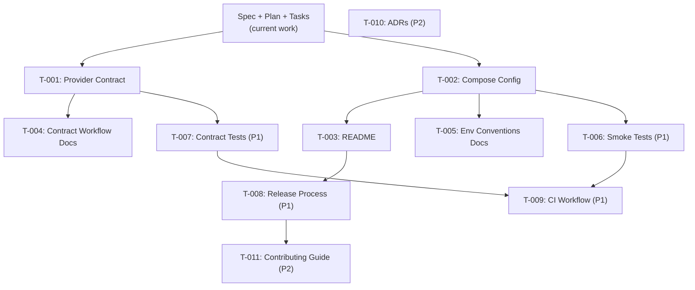

# Task List — Integration Workspace v0.1.0

**Version:** 0.1.0
**Status:** Draft
**Date:** 2026-09-08
**Specification:** [spec.md](spec.md)
**Plan:** [plan.md](plan.md)
**Constitution:** [constitution.md](../../.specify/memory/constitution.md)

> **Scope:** This task list contains ONLY tasks for the `integration-workspace`
> repository. It covers planning, documentation, contracts, orchestration,
> and validation. It does NOT prescribe application implementation tasks for
> `unified-finance-integration-api` or `sage-provider-simulator`.

---

## Task Status Legend

| Symbol | Status |
|---|---|
| ⬜ | Not started |
| 🔄 | In progress |
| ✅ | Complete |
| ❌ | Blocked |

---

## P0 — Core Orchestration and Contracts

### T-001: Create Provider API Contract v1

- **Status:** ⬜
- **Priority:** P0
- **Branch:** `feature/contract-v1`
- **Dependencies:** Specification and plan approved (this file).
- **Description:** Create the versioned provider API contract (OpenAPI 3.x)
  defining the simulator's `/api/v1/invoices` endpoint, including request/response
  schemas, authentication (X-API-Key header), pagination parameters, and error
  responses (401, 429, 500).
- **Deliverables:**
  - `contracts/provider-api-v1.yaml`
  - Invoice response schema
  - Pagination parameters schema
  - Error response schemas
- **Acceptance Criteria:**
  - [ ] Contract is valid OpenAPI 3.x.
  - [ ] Includes `/api/v1/invoices` GET endpoint.
  - [ ] Defines X-API-Key security scheme.
  - [ ] Defines pagination query parameters (`page`, `per_page`).
  - [ ] Defines 200, 401, 429, 500 response schemas.
  - [ ] Includes invoice object schema with required fields.
  - [ ] Contract version field is set to `v1.0`.
- **Traces to:** FR-003, CSI-001

---

### T-002: Create Docker Compose Configuration

- **Status:** ⬜
- **Priority:** P0
- **Branch:** `feature/compose-setup`
- **Dependencies:** T-001 (contract defines service interactions).
- **Description:** Create `compose.yaml` defining three services (api, simulator, db)
  with build contexts, ports, environment variables, networks, and health checks.
- **Deliverables:**
  - `compose.yaml`
  - `.env.example`
- **Acceptance Criteria:**
  - [ ] `compose.yaml` defines `api`, `simulator`, and `db` services.
  - [ ] `api` builds from `../unified-finance-integration-api`.
  - [ ] `simulator` builds from `../sage-provider-simulator`.
  - [ ] `db` uses `mysql:8` image.
  - [ ] All services are on a shared Docker network.
  - [ ] Health checks are configured for all services.
  - [ ] `api` depends on `db` and `simulator` with health conditions.
  - [ ] `.env.example` contains all required variables with placeholder values.
  - [ ] No real secrets are present in either file.
- **Traces to:** FR-001, FR-002, FR-010, AC-001

---

### T-003: Create Repository README

- **Status:** ⬜
- **Priority:** P0
- **Branch:** `feature/compose-setup` (bundled with T-002)
- **Dependencies:** T-001, T-002.
- **Description:** Create a comprehensive README documenting project purpose,
  architecture overview, prerequisites, setup instructions, development workflow,
  and links to specifications.
- **Deliverables:**
  - `README.md`
- **Acceptance Criteria:**
  - [ ] Describes the ecosystem and three-repository structure.
  - [ ] Includes architecture diagram or link to plan.md diagram.
  - [ ] Lists prerequisites (Docker, Docker Compose, Git).
  - [ ] Provides step-by-step local setup instructions.
  - [ ] Documents `docker compose up` and `docker compose down` commands.
  - [ ] Links to specification, plan, and task list.
  - [ ] Clearly states the simulator is a local portfolio simulator.
  - [ ] All content is in English.
- **Traces to:** FR-005, FR-006, NFR-003, NFR-004, CSI-005

---

### T-004: Document Contract Change Workflow

- **Status:** ⬜
- **Priority:** P0
- **Branch:** `feature/contract-v1` (bundled with T-001)
- **Dependencies:** T-001.
- **Description:** Create documentation describing how to modify the provider
  API contract, including the step-by-step process, branch coordination across
  repositories, and verification requirements.
- **Deliverables:**
  - `docs/contract-change-workflow.md`
- **Acceptance Criteria:**
  - [ ] Documents the 5-step contract change process.
  - [ ] Explains linked feature branches across repositories.
  - [ ] Specifies who reviews and approves contract changes.
  - [ ] Describes contract versioning rules.
  - [ ] References the contract location in `contracts/`.
- **Traces to:** FR-004, CSI-001

---

### T-005: Document Environment Configuration Conventions

- **Status:** ⬜
- **Priority:** P0
- **Branch:** `feature/compose-setup` (bundled with T-002)
- **Dependencies:** T-002.
- **Description:** Create documentation establishing environment variable naming
  conventions, the role of `.env.example`, and how services discover configuration.
- **Deliverables:**
  - `docs/environment-conventions.md`
- **Acceptance Criteria:**
  - [ ] Defines variable naming convention (e.g., `SERVICE_VARIABLE_NAME`).
  - [ ] Explains the `.env` / `.env.example` pattern.
  - [ ] Lists all required variables per service.
  - [ ] States that `.env` is in `.gitignore` and never committed.
  - [ ] States that all values in `.env.example` are placeholders.
- **Traces to:** FR-002, NFR-002, CSI-002

---

## P1 — Validation and Process Documentation

### T-006: Create Integration Smoke Tests

- **Status:** ⬜
- **Priority:** P1
- **Branch:** `feature/integration-tests`
- **Dependencies:** T-002, FastAPI and Flask services implemented (external).
- **Description:** Create integration smoke tests that verify the end-to-end flow
  via the Compose stack: sync trigger → invoice retrieval → dashboard check.
- **Deliverables:**
  - `tests/integration/test_smoke.py`
  - `tests/integration/conftest.py`
  - `tests/integration/requirements.txt`
- **Acceptance Criteria:**
  - [ ] Tests run against live Compose services.
  - [ ] Tests verify sync job triggers successfully.
  - [ ] Tests verify invoices are returned by the API.
  - [ ] Tests verify provider 500 error handling (AC-005).
  - [ ] Tests verify 429 retry/backoff scenarios (AC-005b).
  - [ ] Tests verify pagination traversal (AC-006).
  - [ ] Tests are deterministic and independent.
- **Traces to:** FR-007, AC-002, AC-005, AC-005b, AC-006

---

### T-007: Create Contract Validation Tests

- **Status:** ⬜
- **Priority:** P1
- **Branch:** `feature/contract-tests`
- **Dependencies:** T-001, Flask service implemented (external).
- **Description:** Create contract tests that validate the simulator's responses
  match the provider API contract.
- **Deliverables:**
  - `tests/contract/test_provider_contract.py`
  - `tests/contract/conftest.py`
- **Acceptance Criteria:**
  - [ ] Tests validate response schemas against the contract.
  - [ ] Tests validate authentication behavior.
  - [ ] Tests validate pagination response format.
  - [ ] Tests validate error response schemas.
- **Traces to:** FR-008, CSI-001

---

### T-008: Document Release Process

- **Status:** ⬜
- **Priority:** P1
- **Branch:** `feature/release-docs`
- **Dependencies:** T-003.
- **Description:** Document the Gitflow-based release process for the ecosystem,
  including branch creation, version bumping, cross-repo coordination, and tagging.
- **Deliverables:**
  - `docs/release-process.md`
- **Acceptance Criteria:**
  - [ ] Documents release branch creation from develop.
  - [ ] Documents version bumping process.
  - [ ] Documents cross-repository release coordination.
  - [ ] Documents tagging conventions.
  - [ ] Documents merge-back to develop after release.
- **Traces to:** FR-009, CSI-007

---

### T-009: Add CI Workflow for Integration Workspace

- **Status:** ⬜
- **Priority:** P1
- **Branch:** `feature/ci-setup`
- **Dependencies:** T-006, T-007.
- **Description:** Create GitHub Actions workflow that lints Markdown, validates
  the OpenAPI contract, and runs integration tests (when services are available).
- **Deliverables:**
  - `.github/workflows/ci.yml`
- **Acceptance Criteria:**
  - [ ] Workflow triggers on push and PR to develop.
  - [ ] Lints Markdown files.
  - [ ] Validates OpenAPI contract syntax.
  - [ ] Integration test step exists (may be conditional on service availability).
- **Traces to:** NFR-006, CSI-008

---

## P2 — Advanced Validation and Observability

### T-010: Add Architecture Decision Records (ADR)

- **Status:** ⬜
- **Priority:** P2
- **Branch:** `feature/adr`
- **Dependencies:** None.
- **Description:** Establish an ADR directory and create initial records for key
  architectural decisions (e.g., three-repo structure, contract-first approach).
- **Deliverables:**
  - `docs/adr/0001-three-repo-structure.md`
  - `docs/adr/0002-contract-first-integration.md`
  - `docs/adr/template.md`
- **Acceptance Criteria:**
  - [ ] ADR template follows standard format (Title, Status, Context, Decision, Consequences).
  - [ ] At least two ADRs document key decisions.

---

### T-011: Add Contributing Guide

- **Status:** ⬜
- **Priority:** P2
- **Branch:** `feature/contributing`
- **Dependencies:** T-008.
- **Description:** Create a CONTRIBUTING.md with guidelines for contributing to
  the ecosystem, including branch naming, commit conventions, PR process, and
  cross-repo coordination.
- **Deliverables:**
  - `CONTRIBUTING.md`
- **Acceptance Criteria:**
  - [ ] Documents branch naming conventions.
  - [ ] Documents commit message format.
  - [ ] Documents PR review process.
  - [ ] References the contract change workflow.

---

## Dependency Graph

---

## Summary

| Priority | Tasks | Status |
|---|---|---|
| **P0** | T-001, T-002, T-003, T-004, T-005 | ⬜ Not started |
| **P1** | T-006, T-007, T-008, T-009 | ⬜ Not started |
| **P2** | T-010, T-011 | ⬜ Not started |
